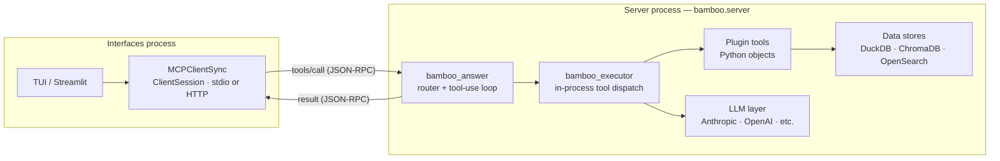
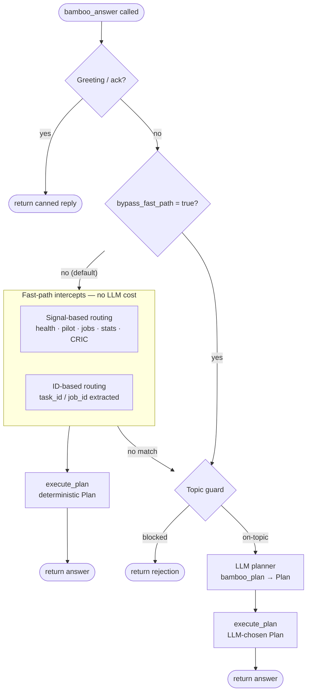

# Bamboo MCP — architecture notes

## Process boundary and MCP wire

Bamboo MCP runs as two separate OS processes. The MCP wire crossing is the boundary
between them — it is the only place where JSON-RPC is used.

**Interfaces process** (TUI or Streamlit): the user-facing layer. It connects to the
server via `MCPClientSync` (`interfaces/shared/mcp_client.py`), which holds an MCP
`ClientSession` and communicates over JSON-RPC 2.0 — either stdio (development) or
streamable HTTP (production). On connection, the client sends an MCP `initialize`
request; the server responds with its declared capabilities before any tool calls
are accepted. The client then calls `list_tools` to discover the available tool
catalog. Only after this handshake does the client begin issuing `tools/call`
requests.

**Server process** (`bamboo.server`): a fully standard MCP server built on the
official MCP Python SDK (`mcp.server.Server`). The server strictly follows the MCP
protocol at the wire level:

- **Capability negotiation**: `list_tools` returns the active tool catalog filtered
  to the configured plugin namespace, keeping the tool list sent to the client
  minimal and experiment-specific.
- **Argument validation**: every inbound `tools/call` is validated against the
  tool's declared `inputSchema` before execution — required fields, `anyOf`
  branches, and `additionalProperties` constraints are all enforced. An invalid
  call is rejected with a descriptive error message rather than silently failing
  inside tool logic.
- **Bearer token authentication**: the HTTP transport enforces a token allowlist
  (`BAMBOO_MCP_TOKENS` / `BAMBOO_MCP_TOKENS_FILE`). The stdio transport is
  unaffected — it is inherently single-user and does not accept HTTP headers.
- **Structured tracing**: every `tools/call` dispatch is wrapped in a tracing span
  recording the tool name and argument keys, giving full observability over the
  server side of the wire.

Once a `tools/call` passes validation, everything that follows is in-process Python.
There is no second wire crossing inside the server.

---

## `bamboo_answer` — routing logic

`bamboo_answer` is the single entry point exposed to the interfaces layer. It
receives a question plus optional conversation history, routes to the right tool or
tools, drives execution, and returns a synthesised natural-language answer.

### Routing stages

**1. Social intercepts** — greetings and acknowledgements are handled with canned
responses at zero LLM cost.

**2. Fast-path intercepts** (default, `bypass_fast_path=false`) — deterministic
routing that avoids LLM overhead for unambiguous questions:

- *Signal-based*: recognises keyword patterns in the question and routes directly.
  Covered cases in priority order: PanDA server health, site health (pilot workers
  + jobs combined), pilot-only questions, job statistics, jobs DB / CRIC queries,
  prompt-log queries, code-query follow-ups.
- *ID-based*: if a `task_id` or `job_id` is extracted from the question or resolved
  from history, a deterministic plan is built immediately.

When a fast-path fires, a `Plan` is constructed without calling the LLM and passed
directly to `bamboo_executor`.

**3. Topic guard** — reached when no fast-path matched, and always reached when
`bypass_fast_path=true`. Off-topic questions are rejected here. Content-free
follow-ups (e.g. "why?" after a prior answer) are rewritten to include enough
context for the planner.

**4. LLM planner** (`bamboo_plan`) — for ambiguous or multi-step questions the LLM
selects the tools to call, builds the argument list, and returns a `Plan`. The
planner's tool catalog is restricted to the active plugin namespace so it cannot
select tools from other experiments.

**5. `bamboo_executor`** — receives a `Plan` from either path, resolves each tool
from the Python `TOOLS` registry (or plugin entry points), calls
`await tool_obj.call(args)` in-process, collects evidence, and drives a final LLM
synthesis call to produce the natural-language answer.

### `bypass_fast_path` flag

Setting `bypass_fast_path=true` skips all deterministic intercepts and hands the
question directly to the topic guard and LLM planner. This is useful when:

- **Testing planner coverage**: verifying that the LLM planner selects the correct
  tools for questions that would normally be short-circuited by the fast-path.
- **Forced LLM routing**: in cases where the fast-path heuristics misfire and the
  LLM would make a better routing decision.

The flag is exposed in the `bamboo_answer` input schema and can be passed by any
interface or scripted test.

---

## Data stores and background services

The plugin tools read from local data stores populated by background service scripts
(`bamboo-mcp-services`):

| Store | Contents | Populated by |
|---|---|---|
| `jobs.duckdb` | BigPanDA job metadata | Job ingestion service |
| `cric.db` | ATLAS queue metadata | CRIC sync service |
| `ChromaDB` | Document vectors | Document embedder |

The service scripts are scheduled processes with no LLM, no tool selection, and no
goal-directed reasoning. They ingest, transform, and store data; they do not make
decisions.

---

## Plugin namespacing

Each experiment has its own plugin package (`askpanda_atlas`, `askpanda_epic`,
`askcgsim`, …). Tools are registered as Python entry points and identified by
namespaced names such as `atlas.job_stats` or `cgsim.sim_query`.

The active plugin is selected at server startup via environment variable. When the
LLM planner is used, its tool catalog is restricted to the active plugin namespace,
preventing cross-experiment tool selection.
